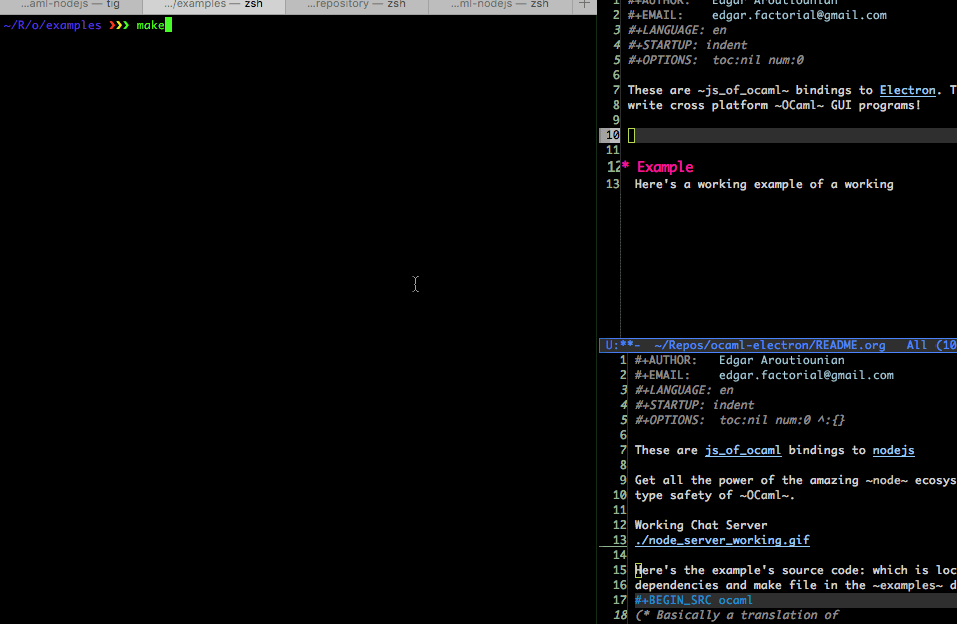

These are `js_of_ocaml` bindings to [Electron](https://github.com/atom/electron). This is a great way to
write cross platform `OCaml` GUI programs with the latest and greatest
web based technologies.

# Example

This is an electron program built at a hackathon using basecamp's Trix
editor and these bindings.



The source code for this program is:

```ocaml
 1  open Nodejs_kit
 2  
 3  let () =
 4    let app = Electron_main.App.require () in
 5    let main_window = ref Js.null in
 6    app##on
 7      !$"window-all-closed"
 8      !@begin fun () ->
 9      if (Js.to_string Nodejs.Process.process##.platform) <> "darwin"
10      then app##quit ()
11    end;
12    app##on
13      !$"ready"
14      !@begin fun () ->
15  
16      main_window :=
17        Js.Opt.return
18          (new%js Electron_main.Browser_window.browser_window
19            (object%js val height = 600 val width = 800 end));
20  
21      let main_window_now = Js.Opt.get !main_window (fun () -> assert false) in
22  
23      main_window_now##loadUrl
24        !$(Printf.sprintf "file://%s/index.html" (__dirname ()));
25  
26      main_window_now##on
27        !$"closed"
28        !@begin fun () ->
29        main_window := Js.null
30      end
31    end
```
