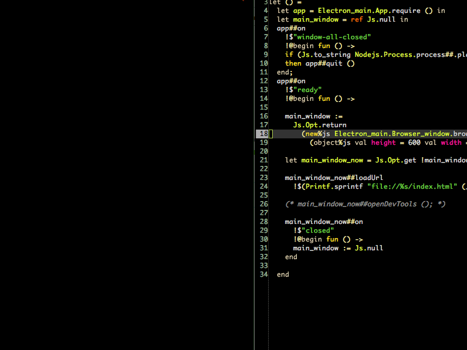

These are `js_of_ocaml` bindings to [Electron](https://github.com/atom/electron). This is a great way to
write cross platform `OCaml` GUI programs with the latest and greatest
web based technologies.

# Example

This is an electron program built at a hackathon using basecamp's Trix
editor and these bindings.



The source code for this program is:

```ocaml
 1  open Nodejs
 2  
 3  module B = Electron_main.Browser_window
 4  
 5  let () =
 6    let main_window = ref Js.null in
 7    let app = new Electron_main.App.app in
 8    let p = new process in
 9  
10    Printf.sprintf "Running %s %s on %s" app#name app#version p#platform
11    |> print_endline;
12  
13    app#on_window_all_closed (fun () -> if p#platform <> "darwin" then app#quit);
14  
15    app#on_ready begin fun () ->
16  
17      let b = new B.browser_window B.({width = 800; height = 600}) in
18      main_window := Js.Opt.return b;
19  
20      b#load_url (Printf.sprintf "file://%s/index.html" (__dirname ()));
21  
22      b#on_closed (fun () -> main_window := Js.null )
23  
24    end
```

Pretty amazing.
